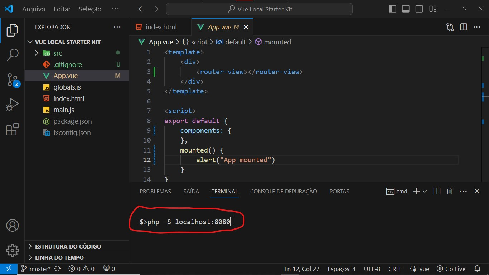

# Vue Local Starter Kit

The [Vue Local Starter Kit](https://github.com/CodeShark37/Vue-Local-Starter-Kit) is a development template for Vue 2.x applications with SFC (Single File Components .vue*) directly in the browser, No build steps, No Vue-CLI and Nodejs.

# Dependencies

 - [Vue](https://github.com/vuejs/vue) - 2.x.x 
 - [VueHead](https://github.com/ktquez/vue-head) - 2.2.0
 - [VueRouter](https://github.com/vuejs/router) - 3.0.0
 - [Vuex](https://github.com/vuejs/vuex) - 3.6.2
 - [Vue2-SFC-Loader](https://github.com/FranckFreiburger/vue3-sfc-loader) - v0.8.4 for vue2 
 - [Axios](https://github.com/axios/axios) >= 1.6.0

## Instalation

- Download the repo: `https://github.com/CodeShark37/Vue-Local-Starter-Kit.git`

## Quick start

 - 

## Contribuition
 - Be free to **open issues** for requesting *new features*, or **pull requests** to add a *new features*.